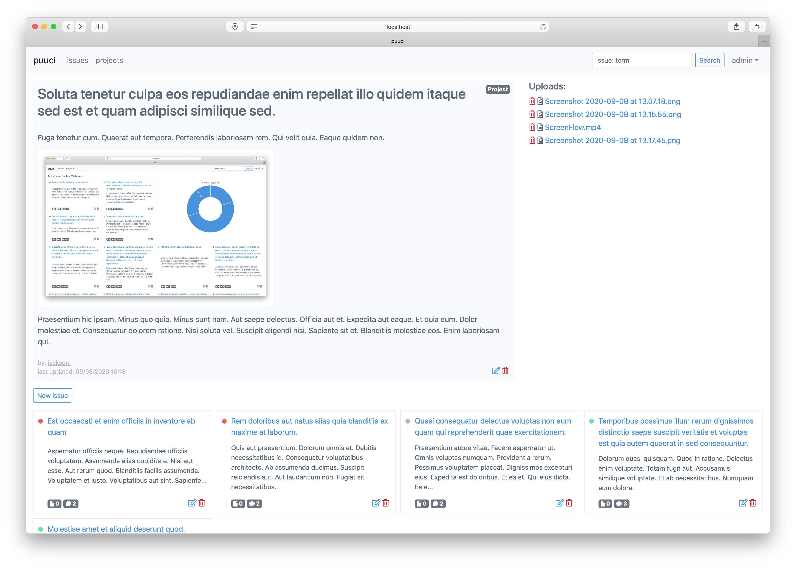

# Issue Tracker MVP built with Sinatra



What's up with the name? - Those are just the first letters of the model names used. 

Users can submit projects, issues and comment on issues. 
Issues and projects can have files(uploads) attached to them.

### How to run

To view emails install [mailcatcher](https://github.com/sj26/mailcatcher):

```
gem install mailcatcher
mailcatcher
open http://127.0.0.1:1080/
```

And [foreman](https://github.com/ddollar/foreman) to run the app

```
bundle
yarn
rake db:create db:migrate db:seed
foreman start
```
